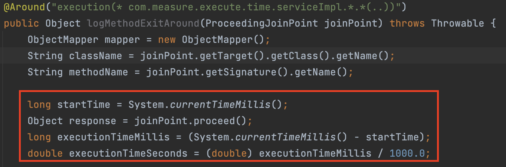
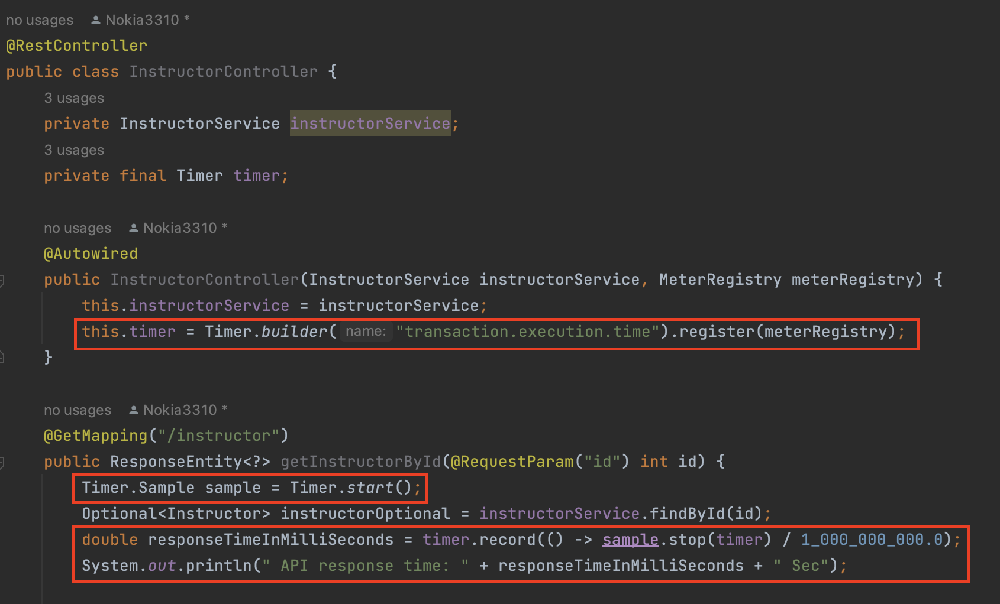

# spring-boot-measure-execute-time
## Introduction
I recently worked closely with the capacity team, and they have requested the application team to supply data fields related to the "execution time for each transaction." This request aligns with the capacity team's overarching objective of sourcing pertinent data to support analysis, budgeting, resource allocation, and the forecasting of future application growth. The inclusion of transaction execution time is a specific requirement in this context.

Consequently, I have chosen to document my research findings in this blog to address the requirements of the capacity team.

## Execute Time
`Transaction execution time` refers to the duration starting from when a request is sent to our service, through the processing of that request, until the response is sent back to the client. It encapsulates the entire lifecycle of a transaction, measuring the time taken for the service to handle and complete the request and provide a response to the client.

Spring Boot offers a variety of methods for measuring execution time and other metric aspects. In this blog, I will illustrate a few approaches to measuring the execution time of transactions with practical examples.

## 1.Measuring execution time using Spring AOP
This is a very easy way that you just implement the AOP concept to capture logs, which I have a blog to provide an example of implementing here [spring-boot-centralized-logging-aop](https://github.com/santipabWannakiri/spring-boot-centralized-logging-aop)\
Once you've followed the provided example, you may need to make slight adjustments to the code, particularly in the @Around like the picture below.



## 2.Using Micrometer Timer Object
Leveraging Micrometer proves highly advantageous as it facilitates the measurement of transaction execution time and offers a versatile set of interfaces including gauges, counters, and distribution. Additionally, Micrometer provides seamless integration with prominent observability systems such as Prometheus, CloudWatch, Dynatrace, and more.\
To incorporate Micrometer into your project, consider following the instructions outlined below:

1. Add Micrometer Core dependency
 ```
        <dependency>
            <groupId>io.micrometer</groupId>
            <artifactId>micrometer-core</artifactId>
            <version>${micrometer.version}</version>
        </dependency>
 ```

2. Modify the code in either the Controller or Service class based on your specific use case. In this example, I've placed it in the Controller as shown below:

   

#### NOTE:
>`Timer.builder("transaction.execution.time")`: This creates a Timer.Builder for a Micrometer Timer with the specified name, in this case, "transaction.execution.time". The name helps identify the timer in the metrics system.

>`register(meterRegistry)`: The MeterRegistry is responsible for managing and publishing metrics to a monitoring system. In a Spring Boot application, the meterRegistry is typically provided by the Micrometer integration with the chosen monitoring system (e.g., Prometheus).

>`Timer.start()`: This static method is part of the Micrometer Timer class, and it returns a new Timer.Sample instance. This sample is used to measure the time taken for a specific block of code.

>`timer.record`: method of the Micrometer Timer to capture the duration of the code block enclosed in the lambda expression. 

>`sample.stop(timer)`: part stops the timer and returns the elapsed time in nanoseconds.

## 3.Using Spring Boot Actuator
This way, it might not provide exactly the execution time. However, I believe it is still good to know what metrics the actuator can provide for us. In order to start up the actuator, please follow the instructions below.

1. Add Actuator dependency
 ```
		<dependency>
			<groupId>org.springframework.boot</groupId>
			<artifactId>spring-boot-starter-actuator</artifactId>
		</dependency>
 ```

2. Enable "metrics" in the application.properties file for the endpoint will be accessible via HTTP in the Actuator's web interface.
 ```
management.endpoints.web.exposure.include=metrics
 ```

3. Access to `http://localhost:8080/actuator/metrics` You're going to see a list of endpoints that you can access to view the information.
```json
{
    "names": [
        "application.ready.time",
        "application.started.time",
        "disk.free",
        "disk.total",
        "executor.active",
        .....
    ]
}
```

4. I suggest taking a look at `http.server.requests` enpoint, and to access them, the URL will be like this: `http://localhost:8080/actuator/metrics/http.server.requests`

```json
{
    "name": "http.server.requests",
    "baseUnit": "seconds",
    "measurements": [
        {
            "statistic": "COUNT",
            "value": 10.0
        },
        {
            "statistic": "TOTAL_TIME",
            "value": 0.14230216499999998
        },
        {
            "statistic": "MAX",
            "value": 0.055251792
        }
    ],
    "availableTags": [
        {
            "tag": "exception",
            "values": [
                "none"
            ]
        },
        ....
    ]
}
```
#### NOTE: 
>`COUNT`: The total number of requests (10 in this case).\
>`TOTAL_TIME`: The cumulative time spent processing these requests.\
>`MAX`: The maximum time taken by a single request.

